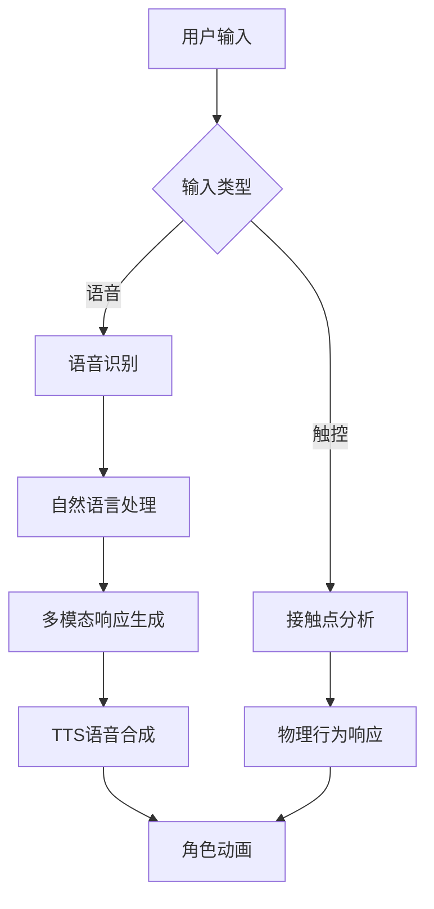
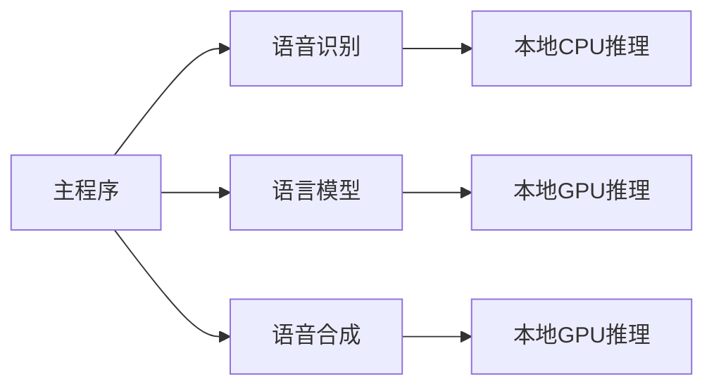

# TIANQI

这是一个非常强大的AI助手项目，集成了多种功能，以下是详细介绍：

## 🌟 项目简介
这是一个由人工智能驱动的项目，支持高度自定义的交互行为。项目采用模块化设计，集成以下核心功能：

- 🎭 智能交互能力
- 🗣️ 语音识别与合成
- ✨ 多模态响应生成

## 🚀 核心特性
### 🌈 交互功能

### 🛠️ 快速部署
#### 系统要求
- Windows 10/11 x64
- NVIDIA GPU (推荐RTX 20系列以上)

#### 最低运行
- Windows 10/11 x32
- i5-4 代

#### 安装步骤
1. 从指定页面下载最新版本
2. 解压到目标目录（建议使用英文路径）
3. 运行主程序

#### API密钥配置（获取指南）
- 阿里云百炼大模型：登录百炼控制台，创建应用 → 获取API Key，填入配置 → 人工智能 → 云端推理
- 讯飞语音服务：登录讯飞云控制台，创建 语音听写（流式版） 应用 → 获取 API 信息，填入配置 → 人工智能 → 云端推理

## 🧩 插件开发
### 插件市场 - 官方
| 插件名称 | 功能描述 | 版本 |
| --- | --- | --- |
| 插件管理 | 管理已安装插件 | 0.0.2 |
| 养成系统 | 智能训练与成长系统 | 0.5.0 |

### 🔧 本地化部署指南
🚨 重要提示：本地部署需 1.42GB 以上可用存储空间
⚠️ 最低的配置会占用 3.22GB 以上的存储空间

## 🌐 服务架构拓扑

## 📜 开源协议
本项目采用 GPL-3.0 License，核心限制包括：
- 修改代码必须开源
- 衍生作品需明确标注原始版权
- 不得用于军事用途

商业使用请联系作者获取商业授权。
